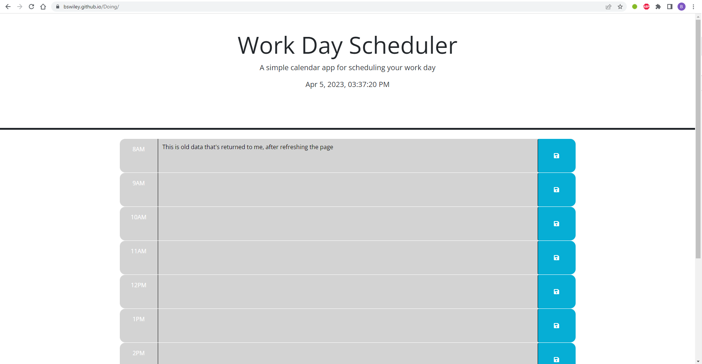

# Doing 

## Description
This website is a calendar for the work day (one day only, so "today's workday") from 8AM to 6PM.  Each hour has a text area that you can record your planned events for the day.  It tells you today's date and time at the top and tracks what hour in the calandar you are with the changing of the text area's colors.  Green blocks will be in the future, while the orange block is the current hour.  After time passes, all the blocks will eventually turn gray.  The "disk" buttons to the right are meant to save the events so that, if you come to the webpage later, you will still have access to those events (but not if you use it on a different computer).  Every time the website is brought up or refreshed, it will look for and put the stored events on the page until they are changed.  If it hasn't been used, before, and nothing saved, the scehduler will remain blank.  

## Installation
I have already deployed this to the website https://bswiley.github.io/Doing/ so nothing further needs to be done to get it to work.  A copy of the index is at the same level in the repository as is this README.md file.  Also in the same directory is a  of the finished webpage.  

## License
This websight is has the MIT license which allows you to use, or alter this website as you see fit.  